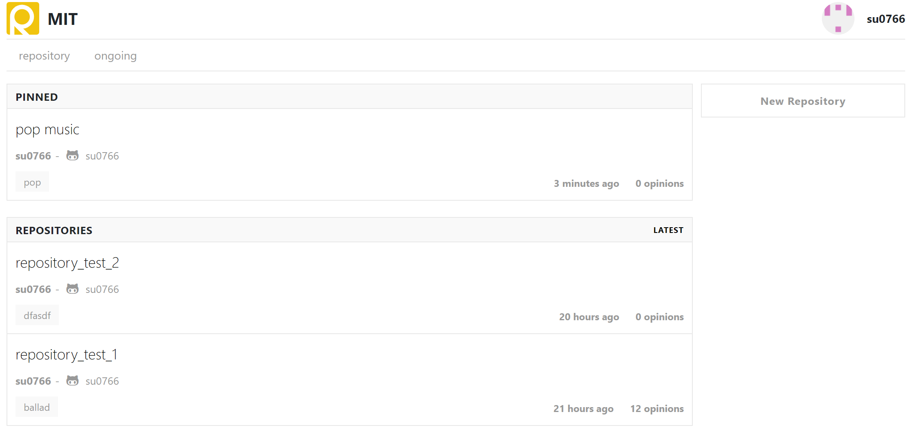
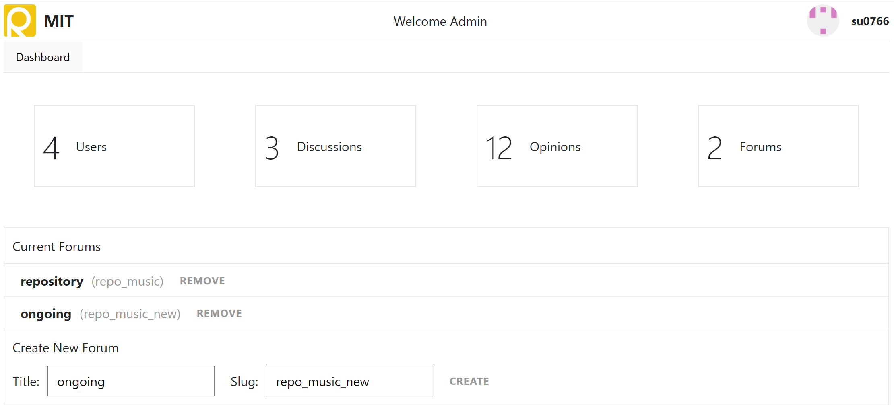

## Forum Server MIT
* [React](https://facebook.github.io/react/)
* [Redux](http://redux.js.org/)
* [Webpack](https://webpack.js.org/)
* [ExpressJS](https://expressjs.com/)
* [PassportJS](http://passportjs.org/)
* [MongoDB](https://www.mongodb.com/)
* [Docker](https://hub.docker.com/)

* Open Source Originated by [Reforum](https://github.com/proshoumma/ReForum)
-----

### Home View


### Admin View


### Application Features
* Users can post a discussion
* Users can reply their opinions regarding discussion
* Users have their own profile page
* Admin can create new forum categories
* Admin have a lot of power over every users discussions and opinions :-p
-----

## Usage
### Webpage
```
* [webpage](http://http://101.101.211.186:8080/)
```
### Docker
```
docker build -t .
```
```
docker run -d p 8080:8080 --name tag tag
```

### Run manually
To run the app in development environment:
```
$ npm run start:dev
```

To run the app in production environment:
```
$ npm run start
```

## License
[MIT License](https://github.com/shoumma/Mister-Poster/blob/master/LICENSE)
